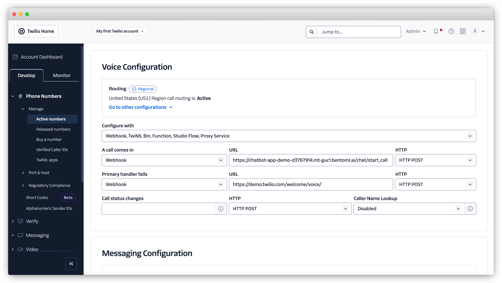

<div align="center">
    <h1 align="center">Building a Voice Chatbot with an Open-Source LLM</h1>
</div>

This repository demonstrates how to build a voice chatbot using an open-source Large Language Model (LLM). It leverages Twilio for real-time voice interactions and BentoML for serving and deployment.

Key features:

- Uses Twilio for real-time speech-to-text and text-to-speech conversion
- Allows users to interrupt AI responses and adjust the conversation dynamically
- Uses the Llama-3.1-70B-Instruct model
- Exposes two key endpoints:
  - `/chat/start_call`: An HTTP endpoint for initiating Twilio voice calls and generating TwiML responses.
  - `/chat/ws`: A WebSocket endpoint for real-time bidirectional communication, supporting voice streaming.

This example is designed to be customizable and you can extend it by adding more voice agent features.

See [here](https://docs.bentoml.com/en/latest/examples/overview.html) for a full list of BentoML example projects.

## Prerequisites

Clone the repository and install the required dependencies.

```bash
git clone https://github.com/bentoml/BentoTwilioRelay.git
cd BentoTwilioRelay/chatbot

# Recommend Python 3.11
pip install -r requirements.txt
```

## Run the chatbot locally

Make sure you have installed `ffmpeg`.

```bash
# Ubuntu/Debian
sudo apt-get update && sudo apt-get install ffmpeg
```

Run it locally:

```
bentoml serve .
```

On the Twilio voice configuration page, set the webhook URL to include the `/chat/start_call` endpoint (BentoCloud deployment URL is used in the image below).



When calling the Twilio number configured, you will hear the following greeting message:

```bash
"Hi! I'm Jane from Bento M L. Just chat with me!!"
```

## Deploy to BentoCloud

After the chatbot is ready, you can deploy it to BentoCloud for better management and scalability. [Sign up](https://www.bentoml.com/) if you haven't got a BentoCloud account.

Make sure you have [logged in to BentoCloud](https://docs.bentoml.com/en/latest/scale-with-bentocloud/manage-api-tokens.html#log-in-to-bentocloud-using-the-bentoml-cli).

```
bentoml cloud login
```

Deploy it to BentoCloud.

```
bentoml deploy .
```

**Note**: For custom deployment in your own infrastructure, use [BentoML to generate an OCI-compliant image](https://docs.bentoml.com/en/latest/guides/containerization.html).